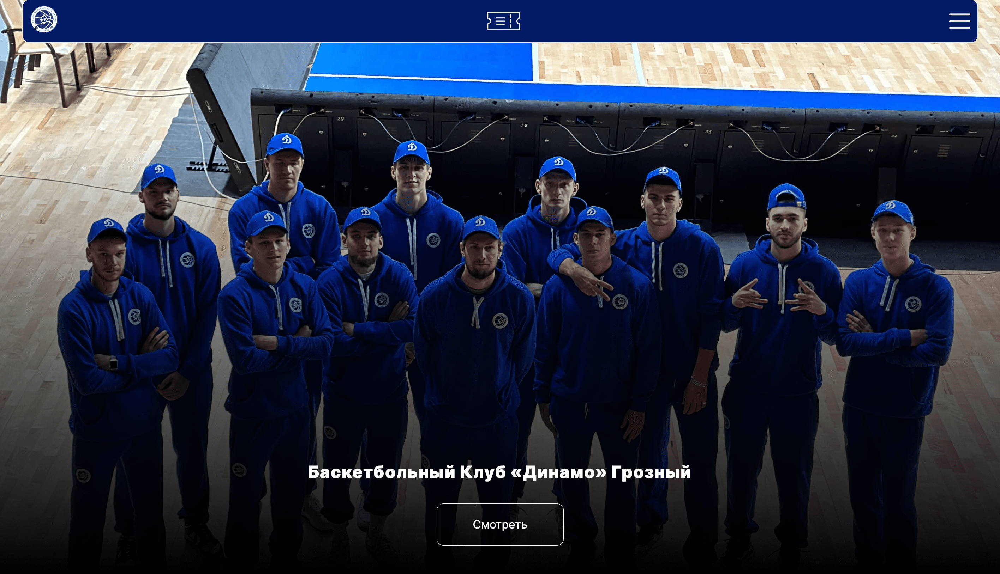
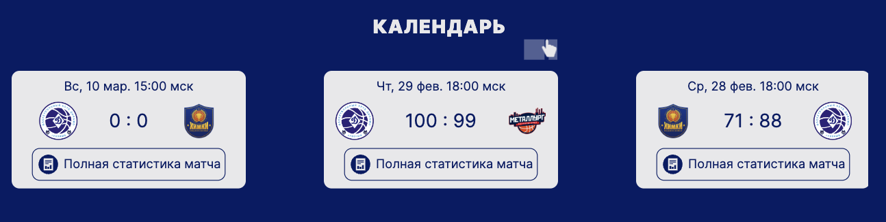
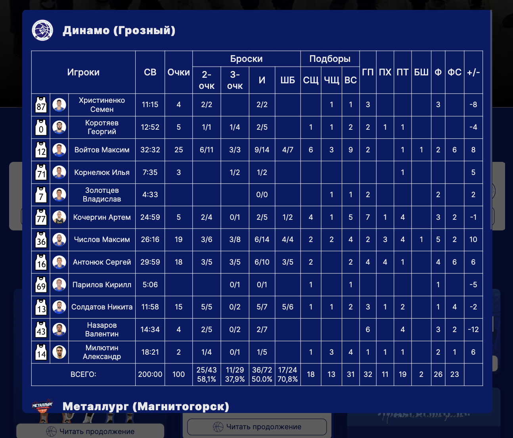
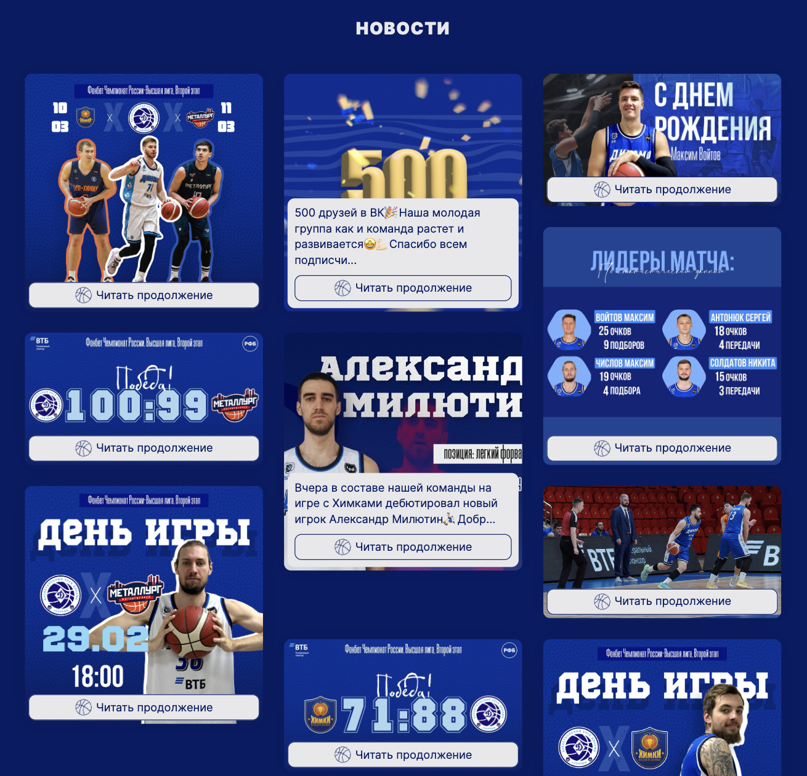
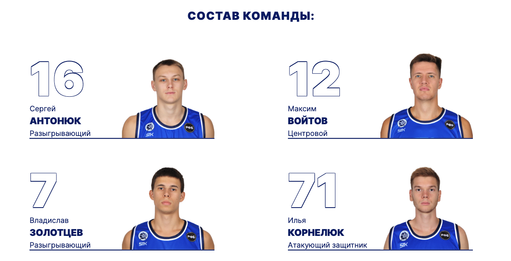

<h1 align="center">Сайт баскетбольного клуба Динамо Грозный</h1>

---

## Функциональность:

---

- конфигурация `webpack` на typeScript
- смена тем сайта компонентом `ThemeSwitcher`
- автоматический прогон тестов через `github actions`
- обработчик ошибок `ErrorBoundary`
- глобальные переменные стилей `global.scss`
- запросы к `API` Российской Федерации Баскетбола
- хелперы `classNames()`, `textSlicer()`, `trimGames()` для решения нестандартных задач

## Стек:

---
  
  
  
  
  
  
  
  
  
  

## Директории проекта:

---

- `.github` — директория с github actions
- `config` — директория с конфигами webpack и jest(в разработке)
- `docs` — директория с production сборкой
- `public` — директория с html
- `src` — директория с архитектурой проекта

### Архитектура проекта - Feature-Sliced Design (FSD):
- `src/shared` — директория с переиспользуемыми модулями
- `src/entities` — директория с компонентами, связанными с представлением бизнес-сущностей
- `src/features` — директория с частями функциональности приложения
- `src/widgets` — директория с самостоятельными и полноценными блоками страниц с конкретными действиями
- `src/pages` — директория со страницами приложения
- `src/app` — директория с общей инициализирующей логикой приложения

## Описание:

***

### GameBar
- Компонент с расписанием матчей;
- Массив с играми запрашивается с API Российской Федерации Баскетбола методом getTeamGames();
- Для отображения нужного кол-ва игр была создана функция trimGames() `src/shared/lib/trimGames`;
- Виджет состоит из компонентов Game, которые имеют кнопку открытия модального окна с протоколом игры;
- За передачу стейта в различные компоненты отвечает GamesProvider;

### GameProtocol
- Модальное окно с протоколом игры;
- Статистика матча запрашивается с API Российской Федерации Баскетбола методом getGameProtocol();
- Виджет состоит из компонентов Table, PersonProtocol;
- За передачу стейта в различные компоненты отвечает ProtocolProvider;

### TimeLine
- Компонент с новостями баскетбольного клуба;
- Массив с новостями находится в константах. В будущем планируется добавить парсер новостей с социальной сети Вконтакте;
- Для отображения нужного кол-ва текста была создана функция textSlicer() `src/shared/lib/textSlicer`;
- Виджет состоит из компонентов News, которые имеют ссылку на полную новость;
- Новости бывают 3 видов: горизонтальные, вертикальные и квадратные. Для стильного отображения использована grid-сетка;

### Roaster
- Компонент с составом игроков;
- Состав команды состоит из 3 сущностей: Player, Coach, Staff;
- Массив запрашивается с API Российской Федерации Баскетбола методом getTeamRoaster();
- За передачу стейта в различные компоненты отвечает TeamProvider;

## Команды для работы с проектом:

---

- `npm start` - запускает проект в `dev` режиме;
- `npm run start:dev:server` - запуск сервера и поднятие БД;
- `npm run build:prod` - сборка проекта в `prod` режиме;
- `npm run build:dev` - сборка проекта в `dev` режиме;
- `npm run lint:ts` - запуск линтнера для `TypeScript`;
- `npm run lint:ts:fix` - исправление ошибок линтнера для `TypeScript`;
- `npm run lint:scss` - запуск линтнера для `SCSS`;
- `npm run lint:scss:fix` - исправление ошибок линтнера для `SCSS`;
- `npm run test:unit` - запуск `unit` тестов;
- `npm run predeploy` — сборка проекта перед деплоем
- `npm run deploy` — деплой проекта на GH-pages

## Планы:

---

- Добавить виджеты положение команд и спонсоры
- Сделать парсер новостей
- Добавить unit тестирование
- Добавить сторибук

## Ссылки на проект:

---

- `Адрес репозитория:` https://github.com/ilkor4/dinamo
- `Деплой:` https://dinamo-grozny.ru
- `Над проектом работал:` https://github.com/ilkor4
